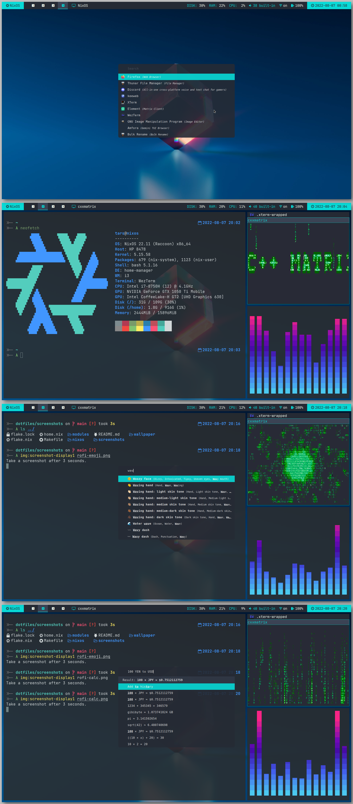

# home

**NixOS/Nix/Flakes | home-manager | i3wm | polybar | rofi | wezterm | bash with ble.sh**

My home nix configs/dotfiles with `home-manager`(standalone mode) and `configuration.nix`. Still a ways to go. (It will remain a work in progress forever.)

Basically, I let home-manager manage most of the stuff except NixOS system-specific settings. NixOS system-specific settings are in `configuration.nix`. If it's not NixOS you can simply use only the home-manager part.

> However, the home-manager part also uses user and environment specific settings (user names, device names and such), so it is necessary to make adjustments according to your environment.

## Screenshots

<a href="./screenshots/home.png"></a>

## Initial set up

> NOTE: It assumes Nix Flakes feature is available.

### NixOS

- git clone and cd into this repository
- `make os-switch` or `nix develop -c os-switch`
- `make install` or `nix develop -c install` to install home-manager itself and apply the home configuration
- `reboot`

### Non-NixOS (x86_64-linux)

- [install nix](https://nixos.org/download.html#nix-install-linux)
  - `sh <(curl -L https://nixos.org/nix/install) --daemon`
- git clone and cd into this repository
- `make install` or`nix develop -c install` to install home-manager itself and apply the home configuration
- `reboot`

## Utility commands

> NOTE: At first I used Makefile for these commands, but now I've added the devShell commands as well. So you can also use `nix develop` and the devShell commands instead of make. Run `nix develop` then `menu` to see available devShell commands.

### Switch

```sh
# to apply changes
make switch
```

It depends on what has changed but may need to restart i3wm or reboot the entire system.
(Restarting i3wm inplace is `$mod+Shift+r` and it will also restart polybar)

### (NixOS Only) OS Rebuild Switch

```sh
# (NixOS only) to apply `configuration.nix` changes
make os-switch

# or
nix develop -c os-switch
```

### Update

```sh
# may take a few minutes
make update

# or
nix develop -c update
```

### Update the flake lock file only

```sh
make update-lock-only

# or
nix develop -c update-lock-only
```

### Garbage collection

```sh
make gc

# or
nix develop -c gc
```

### Delete old generations and garbage collection

```sh
make gc-all-gen

# or
nix develop -c gc-all-gen
```

This frees up more disk space than `gc`, but it'll deletes all old generations. Don't use this if you don't understand what generation means.

### Others

read `Makefile`